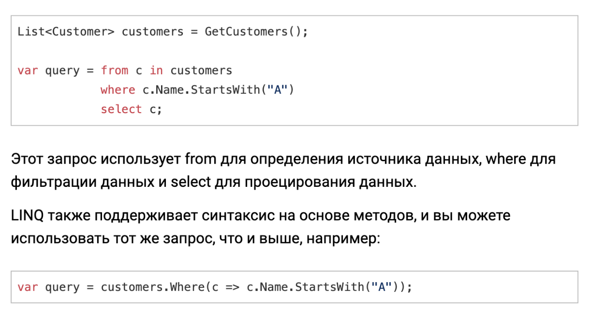

[Вопросы](README.md)

# Общие вопросы

+ [От какого класса неявно наследуются все классы в .NET ?](#от-какого-класса-неявно-наследуются-все-классы-в-net-)
+ [Что такое System.Object ?](#что-такое-systemobject-)
+ [Какие операции со строками вы знаете ?](#какие-операции-со-строками-вы-знаете-)
+ [Какие модификаторы доступа есть в C# ?](#какие-модификаторы-доступа-есть-в-c-)
+ [Поддерживает ли C# множественное наследование ?](#поддерживает-ли-c-множественное-наследование-)
+ [Как запретить наследование от класса ?](#как-запретить-наследование-от-класса-)
+ [Разница между управляемым и неуправляемым кодом ?](#разница-между-управляемым-и-неуправляемым-кодом-)
+ [Что такое рекурсия ?](#что-такое-рекурсия-)
+ [Анонимные функции](#анонимные-функции)
+ [Что такое делегаты ?](#что-такое-делегаты-)
+ [Что такое лямбда-выражение ?](#что-такое-лямбда-выражение-)
+ [Что такое IIS ?](#что-такое-iis)
+ [Что такое LINQ ?](#что-такое-linq-)
+ [Что такое отложенное и немедленное выполнение в LINQ ?](#что-такое-отложенное-и-немедленное-выполнение-в-linq-)
+ [SOLID](#solid)
+ [Как устроена компиляция в .NET ?](#как-устроена-компиляция-в-net-)
+ [Что такое ref и out ?](#что-такое-ref-и-out-)
+ [Что такое атрибут ?](#что-такое-атрибут-)
+ [Что такое "as" и "is" ?](#что-такое-as-и-is-)
+ [что такое чистая функция ? Какие у нее преимущества ?](#что-такое-чистая-функция--какие-у-нее-преимущества-)
+ [контравариантные и ковариантные интерфесы](#контравариантные-и-ковариантные-интерфесы-)

## От какого класса неявно наследуются все классы в .NET ?
В .NET все классы неявно наследуются от базового класса System.Object.

В языке программирования C# и в рамках .NET Framework отсутствует явный базовый класс для всех классов, но все классы неявно наследуются от класса System.Object. В .NET Framework это основной базовый класс, от которого наследуются все типы данных, в том числе и пользовательские классы.

Таким образом, любой класс в C# неявно является производным от System.Object. Этот класс предоставляет базовые методы, такие как Equals, GetHashCode, ToString и др., которые можно переопределить в пользовательских классах.

## [Что такое System.Object ?](https://dev-station.ru/categories/csharp/cheatsheet/csharp-base-cheatsheet#3400)
Все классы в .NET, даже те, которые мы сами создаем, а также базовые типы, такие как System.Int32, являются неявно производными от класса System.Object. Даже если мы не указываем класс System.Object в качестве базового, по умолчанию он всё равно стоит на вершине иерархии наследования. Поэтому все типы и классы могут реализовать те методы, которые определены в System.Object, а именно:

1. ToString служит для получения строкового представления данного объекта.
2. GetHashCode позволяет возвратить некоторое числовое значение, которое будет соответствовать данному объекту или его хэш-код.
3. GetType позволяет получить тип данного объекта.
4. Equals позволяет сравнить два объекта на равенство.

## [Какие операции со строками вы знаете ?](https://dev-station.ru/categories/csharp/cheatsheet/csharp-base-cheatsheet#3389)
1. Конкатенация - string.Concat(s1, s2)
2. Сравнение - string.Compare(s1, s2)
3. Поиск в строке - s1.IndexOf(char)
4. Разбитие/разделение - s1.Split(new char[] { char })
5. Обрезка - s1.Trim() или s1..Trim(new char[] { char1, char2 })
6. Вставка - s1.Insert(index, substring)
7. Удаление части строки - s1.Remove(index, count)
8. Замена - s1.Replace(a, b)
9. Смена регистра - s1.ToLower() и s1.ToUpper()

## [Какие модификаторы доступа есть в C# ?](https://dev-station.ru/categories/csharp/cheatsheet/csharp-base-cheatsheet#3399)
Все типы и члены типов имеют уровень доступности. Он определяет возможность их использования из другого кода в вашей или в других сборках. Сборка — это .dll или .exe, созданные путем компиляции одного или нескольких CS-файлов в одной компиляции. Следующие модификаторы доступа позволяют указать доступность типа или члена при объявлении:

- **public**: доступ к типу или члену возможен из любого другого кода в той же сборке или другой сборке, ссылающейся на него. Уровень доступности общедоступных элементов типа определяется уровнем доступности самого типа.

- **private**: доступ к типу или члену возможен только из кода в том же объекте class или struct.

- **protected**: доступ к типу или члену возможен только из кода в том же объекте class, либо в class, производном от этого class.

- **internal**: доступ к типу или члену возможен из любого кода в той же сборке, но не из другой сборки. Другими словами, internal доступ к типам или членам можно получить из кода, который является частью той же компиляции.

- **protected internal**: доступ к типу или члену возможен из любого кода в той сборке, где он был объявлен, или из производного class в другой сборке.

- **private protected**: доступ к типу или элементу возможен из типов, производных от объекта class и объявляемых в сборке, содержащей этот объект.

## [Поддерживает ли C# множественное наследование ?](https://dev-station.ru/categories/csharp/cheatsheet/csharp-base-cheatsheet#3398)
С# поддерживает множественное наследование в виде наследования от класса и нескольких интерфейсов, или просто от нескольких интерфейсов.

Но не поддерживает наследование от нескольких классов.

## [Как запретить наследование от класса ?](https://dev-station.ru/categories/csharp/cheatsheet/csharp-base-cheatsheet#3402)
Для этого служит ключевое слово *sealed*.

Еще чтобы разрешить наследование класса, но запретить перекрытие метода: указываем класс как public, а метод как sealed.

## [Разница между управляемым и неуправляемым кодом ?](https://dev-station.ru/categories/csharp/cheatsheet/csharp-base-cheatsheet#3379)
**Управляемый код** – это код, созданный компилятором .NET. Он не зависит от архитектуры целевой машины, поскольку выполняется CLR (Common Language Runtime), а не самой операционной системой. CLR и управляемый код предлагают разработчикам несколько преимуществ, таких как сборка мусора, проверка типов и обработка исключений.

С другой стороны, **неуправляемый код** напрямую компилируется в родной машинный код и зависит от архитектуры целевой машины. Он выполняется непосредственно операционной системой. В неуправляемом коде разработчик должен убедиться, что он вручную решает вопросы использования и выделения памяти (особенно из-за утечек памяти), безопасности типов и исключений.

**В .NET компилятор Visual Basic и C# создает управляемый код**. Чтобы получить неуправляемый код, приложение должно быть написано на C или C++.


## Что такое рекурсия ?
Рекурсивная функция представляет такую конструкцию, при которой функция вызывает саму себя.

Возьмем, к примеру, вычисление факториала, которое использует формулу n! = 1 * 2 * … * n. То есть по сути для нахождения факториала числа мы перемножаем все числа до этого числа. Например, факториал числа 4 равен 24 = 1 * 2 * 3 * 4, а факторил числа 5 равен 120 = 1 * 2 * 3 * 4 * 5.

Определим метод для нахождения факториала:
```
int Factorial(int n)
{
    if (n == 1) return 1;
 
    return n * Factorial(n - 1);
}
```

Рекурсивный метод отличается главным образом тем, что он содержит оператор, в котором этот метод вызывает самого себя. Рекурсия является эффективным механизмом управления программой.

## [Что такое делегаты ?](https://dev-station.ru/categories/csharp/cheatsheet/csharp-base-cheatsheet#3387)
*КРАТКО:*

**Делегат** — это объектно-ориентированный способ работы с методом как с переменной. Его более привычный аналог — указатель на функцию, функтор, или даже просто вектор прерывания.

Делегат представляет собой тип, соответствующий определённой сигнатуре функции. Объявив переменную делегатного типа, вы можете записать в неё статический или нестатический метод, передать его как аргумент куда-либо, и вызвать.

Классический пример использования делегатов — сортировка списка объектов по значению какого-либо поля. Вы передаёте в сортирующий метод делегат, который по объекту вычисляет ключ сортировки, то есть, вытаскивает значение поля.

*ОБШИРНЕЕ:*

делегаты (delegates) - это тип данных, который представляет ссылку на метод. То есть делегаты - это указатели на методы и с помощью делегатов мы можем вызвать данные методы. Они позволяют передавать методы как параметры другим методам, сохранять ссылки на методы в коллекциях и вызывать их асинхронно.

Делегаты в C# связаны с событиями и обратными вызовами (callbacks), что позволяет реализовать асинхронное программирование и обработку событий.


Для объявления делегата используется ключевое слово delegate, после которого идет возвращаемый тип, название и параметры. Например:
```
delegate void Message();
```

Делегат Message в качестве возвращаемого типа имеет тип void (то есть ничего не возвращает) и не принимает никаких параметров. Это значит, что этот делегат может указывать на любой метод, который не принимает никаких параметров и ничего не возвращает.

Рассмотрим применение этого делегата:

```
Message mes;            // 2. Создаем переменную делегата
mes = Hello;            // 3. Присваиваем этой переменной адрес метода
mes();                  // 4. Вызываем метод
 
void Hello() => Console.WriteLine("Hello METANIT.COM");
 
delegate void Message(); // 1. Объявляем делегат
```

Делегат может указывать на множество методов, которые имеют ту же сигнатуру и возвращаемые тип. Все методы в делегате попадают в специальный список - список вызова или invocation list. И при вызове делегата все методы из этого списка последовательно вызываются. И мы можем добавлять в этот список не один, а несколько методов. Для добавления методов в делегат применяется операция +=:
```
Message message = Hello;
message += HowAreYou;  // теперь message указывает на два метода
message();              // вызываются оба метода - Hello и HowAreYou
 
void Hello() => Console.WriteLine("Hello");
void HowAreYou() => Console.WriteLine("How are you?");
 
delegate void Message();
```

Делегаты можно объединять в другие делегаты. Например:
```
Message mes1 = Hello;
Message mes2 = HowAreYou;
Message mes3 = mes1 + mes2; // объединяем делегаты
mes3(); // вызываются все методы из mes1 и mes2
 
void Hello() => Console.WriteLine("Hello");
void HowAreYou() => Console.WriteLine("How are you?");
 
delegate void Message();
```

## Анонимные функции
Анонимная функция в контексте программирования - это функция, которая не имеет имени и обычно создается непосредственно в месте своего использования. В C# анонимные функции могут быть созданы с использованием лямбда-выражений или делегатов.

Анонимные функции позволяют создавать код более компактным и обычно используются в ситуациях, когда требуется передать небольшую логику как параметр в другой метод, такой как LINQ-запросы, обработчики событий, асинхронные операции и т. д.

## Что такое лямбда-выражение ?
Лямбда-выражение используется для создания [анонимной функции](#анонимные-функции). Используется оператор объявления лямбда-выражения `=>` для отделения списка параметров лямбда-выражения от исполняемого кода. 

Чтобы создать лямбда-выражение, необходимо указать входные параметры (если они есть) с левой стороны лямбда-оператора и блок выражений или операторов с другой стороны.

**Лямбда-выражение** с выражением с правой стороны оператора => называется выражением лямбда. Выражения-лямбды возвращают результат выражения и принимают следующую основную форму.
```
(input-parameters) => expression
```

**Лямбда-оператор** напоминает лямбда-выражение, за исключением того, что инструкции заключаются в фигурные скобки:

```
(input-parameters) => { <sequence-of-statements> }
```

Тело лямбды оператора может состоять из любого количества операторов; однако на практике обычно используется не более двух-трех.
```
Action<string> greet = name =>
{
    string greeting = $"Hello {name}!";
    Console.WriteLine(greeting);
};
greet("World");
// Output:
// Hello World!
```

Входные параметры лямбда-выражения заключаются в круглые скобки. Нулевое количество входных параметров задается пустыми скобками:

```
Action line = () => Console.WriteLine();
```

## Что такое IIS
[Internet Information Services](https://www.dmosk.ru/terminus.php?object=iis) — программное обеспечение для развертывания веб-сервера. Входит в состав Windows.

Поддерживает работу по протоколам [HTTP](protocols.md#что-такое-http), [HTTPS](protocols.md#что-такое-https), [FTP](protocols.md#что-такое-ftp), [SMTP](protocols.md#что-такое-smtp), [POP3](protocols.md#что-такое-pop3).

IIS можно установить не только на Windows Server, но и на клиентскую версию операционной системы. 

## [Что такое LINQ ?](https://dev-station.ru/categories/csharp/cheatsheet/csharp-base-cheatsheet#3385)
LINQ, или Language-Integrated Query, представляет собой набор функций, представленных в C# 3.0, который позволяет вам запрашивать и обрабатывать данные в различных источниках данных, включая массивы, списки и базы данных, используя согласованный и выразительный синтаксис.

Основное преимущество: он позволяет писать выразительный и удобочитаемый код, который можно использовать для фильтрации, сортировки и преобразования данных без необходимости писать сложные циклы и условные операторы.

LINQ включает в себя различные операторы запросов, такие как Where, Select, Join, GroupBy, OrderBy и др., которые позволяют выполнять разнообразные запросы к данным. LINQ также поддерживает анонимные типы, делегаты, лямбда-выражения и анонимные функции, что делает его мощным инструментом для обработки данных в C#.
</br>

## [Что такое отложенное и немедленное выполнение в LINQ ?](https://dev-station.ru/categories/csharp/cheatsheet/csharp-base-cheatsheet#3386)
В LINQ **отложенное выполнение** означает, что запрос не выполняется в указанное время. В частности, это достигается путем присвоения запроса переменной. При этом определение запроса сохраняется в переменной, но запрос не выполняется до тех пор, пока переменная запроса не будет итерирована.

**Немедленное выполнение** запроса полезно, например, если база данных часто обновляется, и в логике программы важно, чтобы результаты, к которым обращаются, были возвращены в той точке вашего кода, где был задан запрос. Немедленное выполнение часто вызывается с помощью таких методов, как Average, Sum, Count, List, ToList или ToArray.

## SOLID
Термин "SOLID" представляет собой акроним (позволяет создать короткое слово или аббревиатуру) для набора практик проектирования программного кода и построения гибкой и адаптивной программы.

Сам акроним образован по первым буквам названий SOLID-принципов:
- Single Responsibility Principle (Принцип единственной обязанности)
- Open/Closed Principle (Принцип открытости/закрытости)
- Liskov Substitution Principle (Принцип подстановки Лисков)
- Interface Segregation Principle (Принцип разделения интерфейсов)
- Dependency Inversion Principle (Принцип инверсии зависимостей)

> Принципы SOLID - это не паттерны, их нельзя назвать какими-то определенными догмами, которые надо обязательно применять при разработке, однако их использование позволит улучшить код программы, упростить возможные его изменения и поддержку.

1. Принцип единственной обязанности: Каждый компонент должен иметь одну и только одну причину для изменения. То есть класс должен быть ответственен лишь за одну конкретную часть функциональности. 


2. Принцип открытости/закрытости - программные сущности должны быть открыты для расширения, но закрыты для модификации. Это означает, что код должен поддаваться расширению без необходимости изменения исходного кода.

    > (например, есть общий метод у повора "готовка", и для каждого разного блюда готовка разная, поэтому можно создать интерфейс с этим методом, который далее для каждого отдельного блюда переопределяется) 

3. Принцип подстановки Лисков - создание иерархий наследования. 
    > (пример: класс фигура абстрактный -> квадрат -> прямоугольник)

4. Принцип разделения интерфейсов (Interface Segregation Principle, ISP) - множество узкоспециализированных интерфейсов лучше, чем один универсальный интерфейс. Это означает, что интерфейсы должны быть разделены так, чтобы клиенты видели только те методы, которые им действительно нужны. Клиенты не должны вынужденно зависеть от методов, которыми не пользуются.
    > (пример: *интерфес* сообщение -> *интерфес* голосовое сообщение, email, текстовое -> *класс* голосовое сообщение, email, текстовое)

5. Принцип инверсии зависимостей (Dependency Inversion Principle, DIP) - модули верхнего уровня не должны зависеть от модулей нижнего уровня. Они должны зависеть от абстракций, а не от конкретных реализаций. Принцип служит для создания слабосвязанных сущностей, которые легко тестировать, модифицировать и обновлять.

## [Как устроена компиляция в .NET ?](https://dev-station.ru/categories/csharp/cheatsheet/csharp-base-cheatsheet#3383)

1. При компиляции исходный код сначала транслируется в IL (независимый от процессора частично скомпилированный код)
2. Затем CIL собирается в байткод и создается сборка CLI (библиотека скомпилированного кода, используемая для развертывания, создания версий и обеспечения безопасности).
3. Перед выполнением кода CLI-код проходит через JIT-компилятор среды выполнения для генерации родного машинного кода.
4. Процессор компьютера выполняет родной машинный код.

## [Что такое ref и out ?](https://dev-station.ru/categories/csharp/cheatsheet/csharp-base-cheatsheet#3391)
**ref** и **out** позволяют передавать в метод ссылки на объекты и для value type, и для reference type.

И **ref**, и **out** позволяют внутри метода использовать **new** и для **class**, и для **struct**.

**out** отличается от **ref** тем, что в его случае метод обязательно пересоздаст переменную.

## Что такое атрибут ?
```
[DllImport("Kernel32", CharSet=CharSet.Auto, SetLastError=true)]
```
**Атрибут** (attribute) - это универсальное средство связи данных с типами, позволяют добавлять любую текстовую информацию о классах, свойствах, методах и т.д. Атрибуты сохраняются с метаданными и могут быть получены при выполнении программы.

Конструкторы атрибутов могут принимать именованные параметры — поля и свойства атрибутов. При задании именованного параметра в конструктор атрибута передается имя свойства или поля, которое должно принять этот параметр. Причем эти свойства и поля должны быть открытыми. Если именованные параметры передаются, то они обязательно должны идти следом за позиционными параметрами, которые явно указаны в конструкторе атрибута. Указание именованных параметров не является обязательным, поэтому при проектировании атрибутов необходимо помнить о том, что некоторые его поля или свойства могут быть не проинициализированы.

## [Что такое "as" и "is" ?](https://dev-station.ru/categories/csharp/cheatsheet/csharp-base-cheatsheet#3401)
Операторы приведения типов.
```
If (o is Employee) {
  Employee e = (Employee) o;
}
```
С помощью оператора **as** программа пытается преобразовать выражение к определенному типу, при этом не выбрасывает исключение. В случае неудачного преобразования выражение будет содержать значение null.

Выражение o is Employee проверяет, является ли переменная o объектом типа Employee.

## что такое чистая функция ? Какие у нее преимущества ?
**Чистая функция** (pure function) в программировании - это функция, которая обладает двумя основными свойствами:
- Отсутствие побочных эффектов (No Side Effects): Чистая функция не должна взаимодействовать с внешними состояниями или изменять какие-либо данные, не переданные ей в качестве аргументов. Она не изменяет глобальные переменные, не взаимодействует с внешней базой данных и не выполняет другие действия, влияющие на состояние программы.
- Детерминированность (Deterministic): Для одних и тех же входных данных чистая функция всегда возвращает одинаковый результат. Она не зависит от состояния программы или внешних условий, что делает ее предсказуемой и легкой в тестировании.

Преимущества чистых функций:
1. Предсказуемость: Использование чистых функций делает код более предсказуемым и легким в понимании, поскольку результат вызова функции зависит только от переданных ей аргументов.
2. Тестирование: Тестирование чистых функций проще, так как для проверки их поведения не требуется учета побочных эффектов или состояний, изменяемых внутри функции.
3. Повторное использование: Чистые функции облегчают повторное использование кода, поскольку их легко внедрять в различные части программы, не беспокоясь о побочных эффектах.
4. Параллелизм и конкурентность: Чистые функции поддерживают легкость в параллельном и конкурентном программировании, поскольку они не зависят от внешних состояний.
5. Оптимизация: Компиляторы могут лучше оптимизировать чистые функции, поскольку они знают, что результат функции зависит только от ее аргументов.

## контравариантные и ковариантные интерфесы
это понятия, связанные с вариацией типов. 

- контравариантные (Out) - можно использовать более специфичный (производный) тип, чем тот, который ожидается в исходном определении интерфейса.
    ```
    interface ICovariant<out T>
    {
        T GetItem();
    }
    ```
- Контравариантные (In) - можно использовать менее специфичный (базовый) тип, чем тот, который ожидается в исходном определении интерфейса.
    ```
    interface IContravariant<in T>
    {
        void SetItem(T item);
    }
    ```

Например, string более конкретен, чем object, потому что string может представлять только строки, тогда как object может представлять объекты любого типа.
